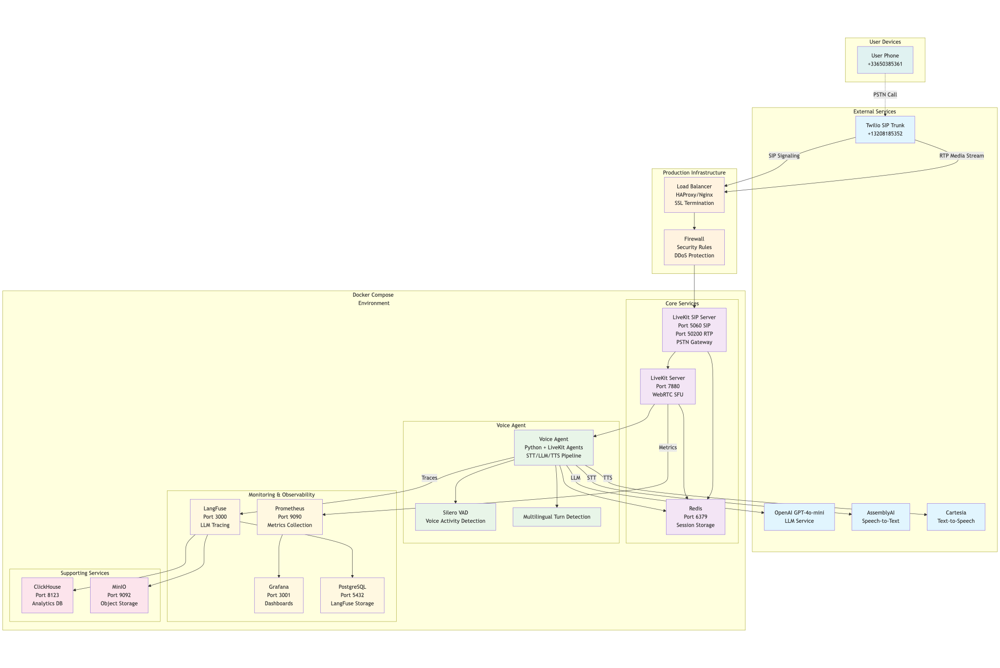
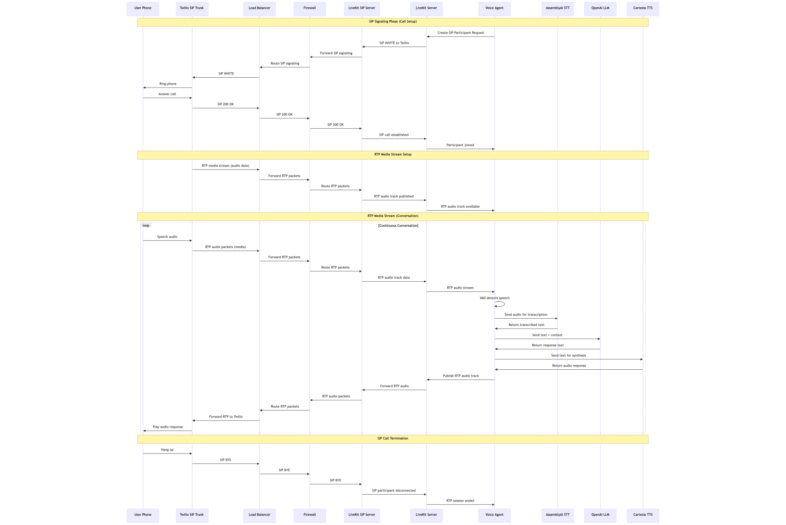

# 🎙️ LiveKit Voice Agent System

A production-ready voice AI agent system capable of handling 100+ concurrent PSTN calls with real-time responsiveness, comprehensive monitoring, and enterprise-grade scalability.

## 🏗️ System Architecture



Our voice agent system provides end-to-end telephony integration with AI-powered conversational capabilities, built on LiveKit's real-time infrastructure.

## 📞 Call Flow



The system handles complete PSTN call lifecycle from SIP signaling through RTP media transport to AI-powered conversation processing.

## 🛠️ Technology Stack

### **Core Infrastructure**
- **LiveKit**: Real-time WebRTC SFU and SIP gateway
- **Kubernetes**: Container orchestration and scaling
- **Redis**: Session storage and caching
- **Docker**: Containerization

### **AI & ML Services**
- **AssemblyAI**: Speech-to-Text with high accuracy
- **OpenAI GPT-4o-mini**: Large Language Model for conversation
- **Cartesia**: High-quality Text-to-Speech synthesis
- **ChromaDB**: Vector database for knowledge retrieval

### **Monitoring & Observability**
- **Prometheus**: Metrics collection and alerting
- **Grafana**: Visualization and dashboards
- **LangFuse**: LLM tracing and analytics
- **OpenTelemetry**: Distributed tracing

### **Telephony Integration**
- **Twilio SIP Trunk**: PSTN connectivity
- **SIP/RTP**: Standard telephony protocols
- **Load Balancer**: Traffic distribution and SSL termination

## 🚀 Quick Start

### Prerequisites

- Docker and Docker Compose
- Kubernetes cluster (local or cloud)
- API keys for: LiveKit, OpenAI, AssemblyAI, Cartesia
- Twilio SIP trunk configuration

### 1. Environment Setup

```bash
# Clone the repository
git clone <repository-url>
cd livekit-voice-agent

# Copy environment template
cp env.example .env.local

# Edit with your API keys
nano .env.local
```

### 2. Local Development (Docker Compose)

```bash
# Start the complete system
docker-compose up -d

# Check service status
docker-compose ps

# View logs
docker-compose logs -f voice-agent
```

**Access Points:**
- **Grafana Dashboard**: http://localhost:3001 (admin/admin)
- **Prometheus**: http://localhost:9090
- **LangFuse**: http://localhost:3000
- **LiveKit Server**: ws://localhost:7880

### 3. Production Deployment (Kubernetes)

```bash
# Configure secrets (replace placeholders)
nano k8s/base/secrets.yaml

# Deploy to production
./k8s/deploy.sh production

# Check deployment status
kubectl get all -n voice-agent-system
```


## 🔧 Configuration

### **Voice Agent Configuration**

The agent supports multiple deployment modes:

```yaml
# Docker Compose
services:
  voice-agent:
    image: voice-agent:latest
    environment:
      - LIVEKIT_URL=ws://livekit:7880
      - OPENAI_API_KEY=${OPENAI_API_KEY}
      - ASSEMBLYAI_API_KEY=${ASSEMBLYAI_API_KEY}
      - CARTESIA_API_KEY=${CARTESIA_API_KEY}
```

```yaml
# Kubernetes
apiVersion: apps/v1
kind: Deployment
metadata:
  name: voice-agent
spec:
  replicas: 5
  template:
    spec:
      containers:
      - name: voice-agent
        image: voice-agent:latest
        env:
        - name: LIVEKIT_API_KEY
          valueFrom:
            secretKeyRef:
              name: livekit-credentials
              key: api-key
```

### **Knowledge Base Integration**

The agent includes a built-in knowledge base for domain-specific queries:

```python
@function_tool()
async def search_knowledge_base(
    self, 
    context: RunContext, 
    query: str
) -> dict[str, Any]:
    """Search the knowledge base for relevant information."""
    results = self.knowledge_base.search(query)
    return {"results": results}
```

**Sample Knowledge Base:**
- Refund policies and procedures
- Product information and features
- Contact information and support
- Objection handling scenarios

## 📈 Monitoring & Observability

### **Grafana Dashboards**

Pre-configured dashboards for:
- **System Performance**: CPU, memory, network usage
- **Audio Quality**: RTT, jitter, packet loss metrics
- **Call Metrics**: Success rates, duration, volume
- **AI Performance**: STT/LLM/TTS latency and accuracy

### **LangFuse Tracing**

Complete LLM observability:
- **Conversation Flows**: End-to-end trace visualization
- **Token Usage**: Cost tracking and optimization
- **Response Quality**: Human feedback integration
- **Performance Analytics**: Latency breakdowns

---

**Built with ❤️ using LiveKit, OpenAI, and modern cloud-native technologies.**
